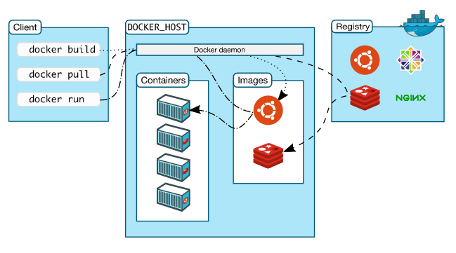
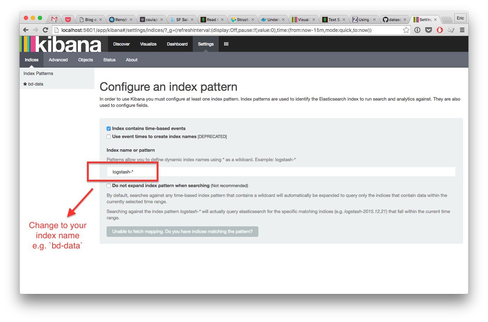
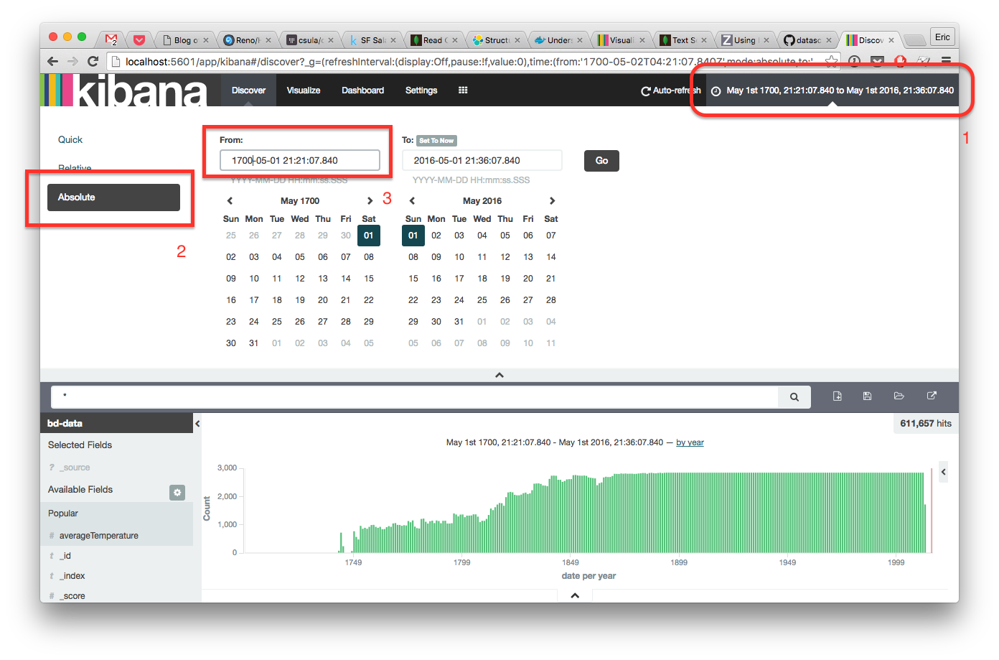
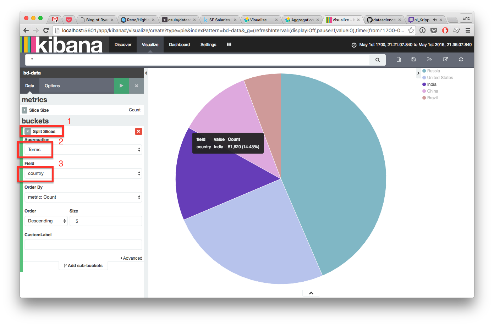

# Data Analysis

Now we have a large amount of data. How do we make sense out of this set of data?

## Objectives

* 5/1
  * Elastic Search Query/Aggregation
* 5/8 -- No class
  * MongoDB Aggregation
    * Sum, count, avg ...
    * Map Reduce
* 5/15, 5/22
  * Python
    * Common math libraries
    * Machine learning
* [Optional knowledge] Hadoop

## Metrics

* Elastic Search query/aggregation
* Kibana visualization
* MongoDB aggregation
* Map reduce concept
* Machine learning algorithms

## Docker Architecture

Due to some questions from students that still don't quite get what Docker is, I want to clarify docker a bit on architecture stand point.

  
Credit: https://docs.docker.com/engine/understanding-docker/

## Exploratory Data Analysis

So far, we have been doing some initial data analysis(IDA) with our data munging process. We tested some of our assumptions on the data shape and clean up accordingly.

Many of you asked me if you data munge process is right. In example, is it right to just clean up the null values? What else should we clean up?

My answer is always "it depends on your question(s) and what you are trying to accomplish".

For instance, some of you are saying you don't need timestamp data because it doesn't fit into your question. So you remove timestamp data out.

This may not be the right move to do just because you think you are may not be using it without going through the process of EDA.

So what is this EDA?

  
credit: https://en.wikipedia.org/wiki/Exploratory_data_analysis

> [EDA] focuses more narrowly on checking assumptions required for model fitting and hypothesis testing, and handling missing values and making transformations of variables as needed. EDA encompasses IDA.

EDA is an examination among data and relationship among variables. EDA is usually the first part of the big analysis process to build the predict model. It is an opportunity to check your assumption about data and to build your intuition about data set.

Many times, business decisions are made by the visualization result from EDA. Other times, you may polish the visualization before you present your finding of data to public.

EDA is about an approach of understanding data using visualization or some statistic model (like what we did in week 1 ... mean, min, max ... etc.).

The objectives of EDA are to:

* Suggest hypotheses about the causes of observed phenomena
* Assess assumptions on which statistical inference will be based
* Support the selection of appropriate statistical tools and techniques
* Provide a basis for further data collection through surveys or experiments

In this course, we will continue with Elastic Search to perform aggregations and use Kibana to do some initial visualization without too much programming behind the scene.

Later on, we will be using MongoDB to learn map reduce concept (again to perform aggregations in scalable way).

Map reduce concept is quite important in a sense that Hadoop is all about map reduce. Even though MongoDB map reduce is different from Hadoop, I think it's a great starting point to see what map reduce can do.

Further, we will also spend about two weeks learning Python and how to use Python to do more analysis or machine learning for better predict model.

John, by next week (May 8th), will talk more in depth about EDA in his video. Stay tuned!

## Elastic Search Query In Depth

Lets do some searching on the weather data we have earlier from last class.

> Note that in the following examples, I'm assuming you all have the Sense with Kibana set up properly.  
> In other word, these code only work within **Sense**.

We will start by talking about `filtering queries` (structured search)

https://www.elastic.co/guide/en/elasticsearch/guide/current/structured-search.html

> When working with exact values, you will be working with non-scoring, filtering queries. Filters are important because they are very fast. They do not calculate relevance (avoiding the entire scoring phase) and are easily cached.

```
GET /bd-data/city-temperatures/_search
{
    "query" : {
        "constant_score" : {
            "filter" : {
                "term" : {
                    "state" : "Washington"
                }
            }
        }
    }
}
```

This finds nothing!? But we looked back to the csv file ourselves, we are able to find the state "Washington". Why?

Elastic search by default will analyze the string fields for full text searching. For instance, if we type in below:

```
GET /bd-data/city-temperatures/_search?q=Washington
```

And we are able to find some records.

Going back to the source code for Elastic Search example. We have to use specific `matchPhrase` as to `match` to look for "Washington" data. This is due to the same reason -- Elastic Search automatically analyze string field.

How do we turn this analyzer off?

```sh
# delete the entire index is required because we cannot change existing
# mapping
DELETE /bd-data

# This add up the index mapping before we add the data
PUT /bd-data
{
    "mappings" : {
        "city-temperatures" : {
            "properties" : {
                "state" : {
                    "type" : "string",
                    "index" : "not_analyzed"
                },
                "date": {
                    "type": "date"
                }
            }
        }
    }
}
```

With above mapping defined, we now can go ahead and re-insert data back to this index by running out elastic search example again.

After data now is inserted back to the index, we can check the mapping by:

```
GET /bd-data/city-temperatures/_mapping
```

And now you should be able to perform normal string search as above:

```
GET /bd-data/city-temperatures/_search
{
    "query" : {
        "constant_score" : {
            "filter" : {
                "term" : {
                    "state" : "Washington"
                }
            }
        }
    }
}
```

Take away?

1. In order to change mapping, you will have to delete entire index first. Therefore, make sure you have your original set of data somewhere ... like in CSV or in your primary database (MongoDB).
2. Be aware of string type mapping


### Internal Filter Operationedit

Internally, Elasticsearch is performing several operations when executing a non-scoring query:

1. Find matching docs.

    The term query looks up the term XHDK-A-1293-#fJ3 in the inverted index and retrieves the list of documents that contain that term. In this case, only document 1 has the term we are looking for.

2. Build a bitset.

    The filter then builds a bitset--an array of 1s and 0s—that describes which documents contain the term. Matching documents receive a 1 bit. In our example, the bitset would be [1,0,0,0]. Internally, this is represented as a "roaring bitmap", which can efficiently encode both sparse and dense sets.

3. Iterate over the bitset(s)

    Once the bitsets are generated for each query, Elasticsearch iterates over the bitsets to find the set of matching documents that satisfy all filtering criteria. The order of execution is decided heuristically, but generally the most sparse bitset is iterated on first (since it excludes the largest number of documents).

4. Increment the usage counter.

    Elasticsearch can cache non-scoring queries for faster access, but its silly to cache something that is used only rarely. Non-scoring queries are already quite fast due to the inverted index, so we only want to cache queries we know will be used again in the future to prevent resource wastage.

    To do this, Elasticsearch tracks the history of query usage on a per-index basis. If a query is used more than a few times in the last 256 queries, it is cached in memory. And when the bitset is cached, caching is omitted on segments that have fewer than 10,000 documents (or less than 3% of the total index size). These small segments tend to disappear quickly anyway and it is a waste to associate a cache with them.

### Combine filters

Recall boolean operation from elasticsearch:

```js
{
   "bool" : {
      "must" :     [], // All of these clauses must match. The equivalent of AND.
      "should" :   [], // At least one of these clauses must match. The equivalent of OR.
      "must_not" : [], // All of these clauses must not match. The equivalent of NOT.
      "filter":    [] // Clauses that must match, but are run in non-scoring, filtering mode.
   }
}
```

Learn by example:

```
GET /bd-data/city-temperatures/_search
{
   "query" : {
      "constant_score" : {
         "filter" : {
            "bool" : {
              "should" : [
                 { "term" : { "state" : "Washington"}},
                 { "term" : { "state" : "California"}}
              ]
           }
         }
      }
   }
}
```

Above is the same as the following sql statement:

```sql
SELECT *
FROM city-temperatures
WHERE state = "Washington" OR state = "California";
# or
SELECT *
FROM city-temperatures
WHERE state IN ("Washington", "California");
```

Does elasticsearch has something like `IN` sql operator? Sometimes we just need to find multiple exact values.

```
GET /bd-data/city-temperatures/_search
{
    "query" : {
        "constant_score" : {
            "filter" : {
                "terms" : {
                    "state" : ["Washington", "California"]
                }
            }
        }
    }
}
```

Consider the below sql query:

```sql
SELECT *
FROM   `city-temperatures`
WHERE  averageTemperature BETWEEN 20 AND 40
```

How do we translate this query to elasticsearch query?

```
GET /bd-data/city-temperatures/_search
{
    "query" : {
        "constant_score" : {
            "filter" : {
                "range" : {
                    "averageTemperature" : {
                        "gte" : 20,
                        "lt"  : 40
                    }
                }
            }
        }
    }
}
```

Cool, that explains the numerical number query. What about date/time? Same idea.

```
GET /bd-data/city-temperatures/_search
{
    "query" : {
        "constant_score" : {
            "filter" : {
                "range" : {
                    "date" : {
                        "gte" : "2012-01-01",
                        "lt"  : "2013-01-01"
                    }
                }
            }
        }
    }
}
```

### Full text search example

https://www.elastic.co/guide/en/elasticsearch/guide/current/full-text-search.html

```
http://localhost:5601/app/sense?load_from=https://www.elastic.co/guide/en/elasticsearch/guide/current/snippets/100_Full_Text_Search/05_Match_query.json
```

Elasticsearch executes the preceding match query as follows:

1. Check the field type.

    The title field is a full-text (analyzed) string field, which means that the query string should be analyzed too.

2. Analyze the query string.

    The query string QUICK! is passed through the standard analyzer, which results in the single term quick. Because we have just a single term, the match query can be executed as a single low-level term query.

3. Find matching docs.

    The term query looks up quick in the inverted index and retrieves the list of documents that contain that term—in this case, documents 1, 2, and 3.

4. Score each doc.

    The term query calculates the relevance `_score` for each matching document, by combining the term frequency (how often quick appears in the title field of each document), with the inverse document frequency (how often quick appears in the title field in all documents in the index), and the length of each field (shorter fields are considered more relevant).

### Aggregation

Quick aggregation types: https://www.elastic.co/guide/en/elasticsearch/reference/current/search-aggregations.html

To master aggregations, you need to understand only two main concepts:

* Buckets

    Collections of documents that meet a criterion

* Metrics

    Statistics calculated on the documents in a bucket

**Buckets**

A bucket is simply a collection of documents that meet certain criteria:

* An employee would land in either the male or female bucket.
* The city of Albany would land in the New York state bucket.
* The date 2014-10-28 would land within the October bucket.

**Metrics**

Most metrics are simple mathematical operations (for example, min, mean, max, and sum) that are calculated using the document values. In practical terms, metrics allow you to calculate quantities such as the average salary, or the maximum sale price, or the 95th percentile for query latency.

Aggregation example in sense:

```
http://localhost:5601/app/sense?load_from=https://www.elastic.co/guide/en/elasticsearch/guide/current/snippets/300_Aggregations/20_basic_example.json
```

```sh
GET /cars/transactions/_search
{
    "size" : 0,
    "aggs" : {  # aggregation syntax
        "popular_colors" : {
            "terms" : { # bucket by color
              "field" : "color"
            }
        }
    }
}
```

You can also combine bucket with metrics like below:

```sh
GET /cars/transactions/_search
{
   "size" : 0,
   "aggs": {
      "colors": {
         "terms": {
            "field": "color"
         },
         "aggs": { # with another aggregation within aggregation!
            "avg_price": {
               "avg": {
                  "field": "price"
               }
            }
         }
      }
   }
}
```

Bucket in bucket with metric aggregation!

```
GET /cars/transactions/_search
{
   "size" : 0,
   "aggs": {
      "colors": {
         "terms": {
            "field": "color"
         },
         "aggs": {
            "avg_price": { "avg": { "field": "price" }
            },
            "make" : {
                "terms" : {
                    "field" : "make"
                },
                "aggs" : {
                    "min_price" : { "min": { "field": "price"} },
                    "max_price" : { "max": { "field": "price"} }
                }
            }
         }
      }
   }
}
```

**Histogram**

```sh
GET /cars/transactions/_search
{
   "size" : 0,
   "aggs":{
      "price":{
         "histogram":{ # using histogram we can build many graph with it (bar, pie or histogram!)
            "field": "price",
            "interval": 20000
         },
         "aggs":{
            "revenue": {
               "sum": {
                 "field" : "price"
               }
             }
         }
      }
   }
}
```

What about time series variables?

```
http://localhost:5601/app/sense?load_from=https://www.elastic.co/guide/en/elasticsearch/guide/current/snippets/300_Aggregations/35_date_histogram.json
```

Sky's the limit!


Sometimes, you want to scope your aggregation. Such as searching only ford cars rather than searching everything all together.

This case you can do query/filter before doing aggregation.

```
http://localhost:5601/app/sense?load_from=https://www.elastic.co/guide/en/elasticsearch/guide/current/snippets/300_Aggregations/40_scope.json
```

Furthermore, if your data has geo location related data. You may want to consider reading through this document:

https://www.elastic.co/guide/en/elasticsearch/guide/current/geoloc.html

### Modeling your data for elasticsearch

Well, elasticsearch provides so many great benefits especially on its performance.

Why don't we use elasticsearch for everything (to replace traditional relational database)?

On one hand, elasticsearch does various things very well. It still has a few points it doesn't scale well.

For instance, handling relationships in elasticsearch is non-trivial.

In short, you want to model your data in elasticsearch or nosql database as flat as possible as opposite to having more relationships in RDBMS.

However, if you still need relationships for your data. Elasticsearch suggests the following approaches:

1. Application side join
2. Data de-normalization
3. Nested objects
4. Parent/child relationships

**Application side join**

Application side join basically have your applicaiton to simulate joins. Consider the following:

```
PUT /my_index/user/1
{
  "name":     "John Smith",
  "email":    "john@smith.com",
  "dob":      "1970/10/24"
}

PUT /my_index/blogpost/2
{
  "title":    "Relationships",
  "body":     "It's complicated...",
  "user":     1
}
```

Then your application would take blogpost and use user as the id to look for data at the `/my_index/user/` + index

**Data de-normalization**

In short, you intentionally store the same data in multiple places like the following:

```
PUT /my_index/user/1
{
  "name":     "John Smith",
  "email":    "john@smith.com",
  "dob":      "1970/10/24"
}

PUT /my_index/blogpost/2
{
  "title":    "Relationships",
  "body":     "It's complicated...",
  "user":     {
    "id":       1,
    "name":     "John Smith"
  }
}
```

This may require you to do locking on your application side in order to update multiple fields at once. I'll be skipping this part of document. If you are interested of learning out more on your own and wanting to apply this knowledge to production. Please look up above on your own.

**Nested objects**

```
PUT /my_index/blogpost/1
{
  "title": "Nest eggs",
  "body":  "Making your money work...",
  "tags":  [ "cash", "shares" ],
  "comments": [
    {
      "name":    "John Smith",
      "comment": "Great article",
      "age":     28,
      "stars":   4,
      "date":    "2014-09-01"
    },
    {
      "name":    "Alice White",
      "comment": "More like this please",
      "age":     31,
      "stars":   5,
      "date":    "2014-10-22"
    }
  ]
}
```

The primary difference between denormalization and nested objects is array vs objects.

You can still perform the search like `comments.name` (this is why you cannot have `.` in your attribute name).

> Please note that if you want to use nested object. Don't rely on the dynamic mapping provided by elastic search. Create the mapping ahead of time before you insert your data.

**Parent/child relationship**

Due to the time constraint, we will skip this part of notes.

## Kibana in action

Demo

To get Kibana working as what we demo today. Please follow the following guidelines:

> Before we started, make sure you have your own unique `cluster.name` set up if you are running elastic search in class with all of us.

1. Start elastic search
2. Start Kibana
3. Run `gradle esExample` to insert data into elastic search
4. Open Kibana
    
5. Upon above, you want to start by by changing the timestamp
    

And with above settings, you will be able to start using Discover mode to start searching your data.

For instance, you can type in `state: "Washington"` to search for Washington data. Or you can do `averageTemperature: [10 TO 20]` to do range search. To read more, follow here: https://www.elastic.co/guide/en/kibana/current/discover.html

From Discovery mode, you can start to do some initial search to see how data flows through time.

But if you want to start your initial EDA, I suggest you to take a look at the visualization tab.

Make sure you start creating your own visualization to look at your data from different angle and ask yourself hard question.

To create visualization, you will need to think in aggregation. If you are not sure how to create visualization or which graph to use, I suggest you to review through the aggregations above.

For example, you can start by creating a pie chart with aggregation of terms like below:



## Python

Please install [Python 2](https://www.python.org/). Please just download 2.7 for this class not version 3.

> For Mac user, use `brew install python`  

Python, one of the top two common languages choice for data science. Why?

Many libraries are written in python. This includes machine learning libraries like [Sci-kit](http://scikit-learn.org/stable/), [NumPy](http://www.numpy.org/) or [Pandas](http://pandas.pydata.org/pandas-docs/stable/10min.html)

So why is Python popular?

* Easy to learn
* Easy to get it up and running
* Syntax is very close to pseudocode
* Interpreted languages (have interpreter built in)

In the following session, we will introduce python from the ground up.

### Syntax

Not like Java, python doesn't have bracket. Python uses **indentation** to detect code block.

What do I mean by indentation? Consider the following:

```python
x = 1

if x > 0:
  print "x is positive"
```

Now when the print statement is not indented properly. it will not be executed in the if statement.

Therefore, it is recommended for you to display all the invisible characters in your favorite text editor.

> Don't ask why your code doesn't work later because your code contain both hard tab and soft tab (4 spaces or 2 spaces)

### Variables and types

In python, to define variable, you don't need to specify types not like Java.

In other word, you can simply assign variable just like below:

```python
# Number
x = 1 + 1
# Boolean (keep it in mind that first character is capitalized)
t = True
# String
y = "Hello, world"
z = "Hello\nworld!"
multiline_string = """
this is multiline string
if you need to print out multiline
you may use three "
"""
concat_str = "Hello" + "," + "world!"
# You can treat word like list and get character(s) out this way
y[1] # e
y[0:2] # He

# List
li = [1, 2, 3]
li[0] # 1
li[:] # return shallow copy of the list
li[1] = 4 # list is now [1, 4, 3]
li.append(5) # list is now [1, 4, 3, 5]
li[2:3] = [] # list is now [1, 4, 5]
len(li) # 3

# nested list
li = [[1, 2], [2, 3], [3, 4]]
```

# Control flow

Control flows includes if, for, while and function.

```python
# if statement doesn't need to be surrounded by parathesis
x = 1

if x > 0:
  print "x is positive"

# for 
li = [1, 2, 3]
for i in li:
  print i
# range
for i in range(10):
  print i # 0 ... 9
# range can also be specific range with lower-bound(inclusive) to upper-bound(exclusive)
for i in range(5, 10):
  print i # 5, 6, 7, 8, 9
# break and continue
for i in range(100):
  if i > 10:
    break
  elif i % 2 == 0:
    continue
  else:
    print i
```

```python
# def is the keyword to define a function
def f(x, y):
  return x + y

f(1, 2) # 3

# python not like java can have default argument value
def g(x, y=1):
  return x + y

g(1) #2

# when calling function, it can provide keyword as argument
def h(x, y, z):
  print x
  print y
  print z
  return x + y - z

h(y=2,x=6,z=10)

# lambda
def l(x):
  return lambda n: n + x

f = l(42)
f(8) # 50

# documentation for function
def messy(z):
  """
  this is a documentation example
  """
  return z + 42

print messy.__doc__
```

### Data structure

**List**

* list.append(x)
  * Add an item to the end of list
* list.extend(anotherList)
  * Extend list from another list
* list.insert(i, x)
  * Insert item x into position i e.g. insert to front of list `list.insert(0, item)`
* list.remove(x)
  * remove the **first** item of value x
* list.pop([i])
  * pop certain item from the list of index i. If no argument is given, pop the last item
* list.index(x)
  * return index of item x
* list.sort()
* list.reverse()

**List as stack**

```python
stack = [3, 4, 5]
stack.append(6)
stack.append(7)
stack
[3, 4, 5, 6, 7]
stack.pop()
7
stack
[3, 4, 5, 6]
stack.pop()
6
stack.pop()
5
stack
[3, 4]
```

**List as queue**

```python
from collections import deque
queue = deque(["Eric", "John", "Michael"])
queue.append("Terry")           # Terry arrives
queue.append("Graham")          # Graham arrives
queue.popleft()                 # The first to arrive now leaves
'Eric'
queue.popleft()                 # The second to arrive now leaves
'John'
queue                           # Remaining queue in order of arrival
deque(['Michael', 'Terry', 'Graham'])
```

**Functional programming with list** like filter, map and reduce

* filter  
```python
def f(x): return x % 3 == 0 or x % 5 == 0
...
filter(f, range(2, 25))
[3, 5, 6, 9, 10, 12, 15, 18, 20, 21, 24]
```
* map  
```python
def cube(x): return x*x*x
...
map(cube, range(1, 11))
[1, 8, 27, 64, 125, 216, 343, 512, 729, 1000]
```
* reduce  
```python
seq = range(8)
def add(x, y): return x+y
...
map(add, seq, seq)
[0, 2, 4, 6, 8, 10, 12, 14]
```

**Tuples**

We saw that lists and strings have many common properties, such as indexing and slicing operations. They are two examples of sequence data types (see Sequence Types — str, unicode, list, tuple, bytearray, buffer, xrange). Since Python is an evolving language, other sequence data types may be added. There is also another standard sequence data type: the tuple.

A tuple consists of a number of values separated by commas, for instance:

```python
>>>
t = 12345, 54321, 'hello!'
t[0]
12345
t
(12345, 54321, 'hello!')
# Tuples may be nested:
... u = t, (1, 2, 3, 4, 5)
u
((12345, 54321, 'hello!'), (1, 2, 3, 4, 5))
# Tuples are immutable:
... t[0] = 88888
Traceback (most recent call last):
  File "<stdin>", line 1, in <module>
TypeError: 'tuple' object does not support item assignment
# but they can contain mutable objects:
... v = ([1, 2, 3], [3, 2, 1])
v
([1, 2, 3], [3, 2, 1])
```

**Set**

Similar to list but with keyword `set`

```python
li = [1, 2, 3, 1]
se = set(li) # set([1, 2, 3])
1 in se # True
4 in se # False

# operation on sets
li2 = set([2, 3, 4])
# in se but not in li2
se - li2 # 1

# union
se | li2 # 1234

# interception
se & li2

# in a or b but not both
se ^ li2
```

**Dictionary**

Dictionary is like map in Java.

```python
tel = {'jack': 4098, 'sape': 4139}
tel['guido'] = 4127
tel

tel['jack']

del tel['sape']
tel['irv'] = 4127
tel

tel.keys()

'guido' in tel

# to loop through
for i, v in enumerate(['tic', 'tac', 'toe']):
  print i, v
```

### Modules

Each python file is essentially a module.

For instance,

```python
# my_math.py

def add(x, y):
  return x + y
```

```python
import my_math

my_math.add(1, 2)
```

**Python main method**

if you have a if statement like below, that block of code will not be executed when you import to other module.

```python
if __name__ == "__main__":
  import sys
  print sys.argv[1]
```

**Packages**

When your code base grows larger, you will need to think about how to organize your code. 

Python will treat folder with `__init__.py` as a package. Think of below:

```
main.py
acquisition/
  __init__.py
  collector.py
  source.py
storage/
  __init__.py
  mongo.py
```

Then in your `main.py` you can start import like below:

```python
# main.py
import acquisition.collector
import aqcuisition.source

while source.hasNext():
  collector.save(collector.munge(source.next()))
```

### File read/write

```python
f = open('file_name.extension', 'r') # second argument is for mode read or write or both!

f.read() # reads out the entire content
f.readline() # reads line by line

# below also works
for line in f:
  print line

f.write('Hello world!\n') # to write to file
```

### json

Json is built-in with Python!

```python
# write json string
json.dumps([1, 'simple', 'list'])

# dump json to a file
json.dumps([1, 'simple', 'list'], f)

# read json string from file
json.load(f)
```

### Exceptions

```python
while True:
  try:
    x = int(raw_input("Please enter a number: "))
    break
  except ValueError:
    print "Oops!  That was no valid number.  Try again..."
```

### Classes

```python
class MyClass: # can defined inheritance MyClass(ParentClass, ParentClass2)
    """A simple example class"""
    i = 12345
    
    def __init__(self):
      print 'no arg constructor is called'

    def f(self): # first argument is always self
        return 'hello world'
```

### CSV

```python
import csv

with open('example.csv', 'rb') as csvfile:
  spamreader = csv.reader(csvfile)
  for row in spamreader:
    print ', '.join(row)
```

### Package manager -- pip

https://pip.pypa.io/en/stable/installing/

### Resources

* https://github.com/vinta/awesome-python
* https://developers.google.com/edu/python/
* [Numpy Tutorial](http://scipy.github.io/old-wiki/pages/Tentative_NumPy_Tutorial.html)
* [Scipy tutorial](http://docs.scipy.org/doc/scipy/reference/tutorial/)
* [Pandas in 10 minutes](http://pandas.pydata.org/pandas-docs/stable/10min.html)
* 
