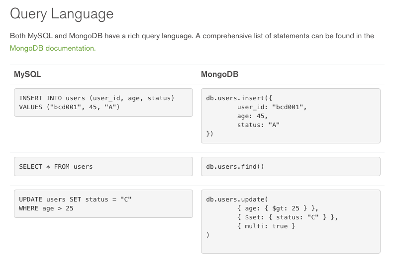

# Data Storage

Volume and variety of data is always a the primary concern of big data. How should we store them?

What about data comes in with high velocity? How do we store them and analyze them in real time?

## Objectives

* 4/17
  * Homework 2 clarification
  * Live demo data acquisition
  * [Set up MongoDB][1]
  * [Java MongoDB Driver][2]
  * Store data from acquisition to MongoDB
  * [Docker][3]
* 4/24
  * [Docker][3]
  * Set up Elastic Search
  * Initial exploration
  * [Optional] HDFS

## Metrics

* 4/17
  * [MongoDB installation][1]
  * [Java MongoDB Driver][2]
  * MongoDB CRUD
  * Docker set up
* 4/24
  * Elastic Search installation
  * Docker provision

## Homework 2

Many students asked questions regarding homework 1 during office hour -- **What is considered to be big data?**

Big data in this class needs to meet at least 2 of the following:

* Volume
* Velocity
* Variety

What does it mean by volume? How large is considered large enough?

To that, lets be more specific on our requirements:

* Volume

  > Text based data at least **3GB**  
  > Non-text based data, please discuss with me before you move on to acquire it.

* Velocity

  > Real time or at least near real time data ... constantly getting new values from data source.

* Variety

  > More than 3 data sources. e.g. Twitter, open weather, CNN news ... etc.

To sum up:

In homework 2, data needs to meet at least two requirements above; or it is not considered to be valid big data.

## Data Collector Demo

Another common questions regarding homework 2 from office hour:

How do I implement this *Collector* and *Source* interface? What does each interface do? How do I collect data from {insert your data source}.

First, we will go over what is our Collector and Source and implement an example of getting data from Twitter in class.

Regarding your question on how do you get data from {insert your data source}:

I will not be answering domain specific questions, such as how do I get data from Twitter.

Why?

This is your choice of your data source and you should be doing a lot of research on how you get data as well as how you are going to use data. In other word, these domain specific questions are your responsibility to answer them to your best effort.

I'd suggest you to Google your question before you ask me any further detail.

Without further due, demo time.

---

## Set up MongoDB

Go to [MongoDB official site][1] and download and install MongoDB on your host machine.

Use `mongod` to start MongoDB server. Once started, you should see something like below:

```sh
# eric @ Erics-MacBook-Pro-2 in ~/Downloads [20:14:24]
$ mongod
2016-04-12T20:14:25.325-0700 I JOURNAL  [initandlisten] journal dir=/data/db/journal
2016-04-12T20:14:25.326-0700 I JOURNAL  [initandlisten] recover : no journal files present, no recovery needed
2016-04-12T20:14:25.342-0700 I JOURNAL  [durability] Durability thread started
2016-04-12T20:14:25.342-0700 I CONTROL  [initandlisten] MongoDB starting : pid=78049 port=27017 dbpath=/data/db 64-bit host=Erics-MacBook-Pro-2.local
2016-04-12T20:14:25.342-0700 I CONTROL  [initandlisten]
2016-04-12T20:14:25.342-0700 I CONTROL  [initandlisten] ** WARNING: soft rlimits too low. Number of files is 256, should be at least 1000
2016-04-12T20:14:25.342-0700 I CONTROL  [initandlisten] db version v3.0.1
2016-04-12T20:14:25.342-0700 I JOURNAL  [journal writer] Journal writer thread started
2016-04-12T20:14:25.342-0700 I CONTROL  [initandlisten] git version: nogitversion
2016-04-12T20:14:25.342-0700 I CONTROL  [initandlisten] build info: Darwin miniyosemite.local 14.1.0 Darwin Kernel Version 14.1.0: Thu Feb 26 19:26:47 PST 2015; root:xnu-2782.10.73~1/RELEASE_X86_64 x86_64 BOOST_LIB_VERSION=1_49
2016-04-12T20:14:25.342-0700 I CONTROL  [initandlisten] allocator: system
2016-04-12T20:14:25.342-0700 I CONTROL  [initandlisten] options: {}
2016-04-12T20:14:26.180-0700 I NETWORK  [initandlisten] waiting for connections on port 27017
```

With above, we will start learning MongoDB by Mongo shell commands for your own debugging. To do this, run `mongo`. This will start your *mongo* shell. You should see something like below:

```sh
# eric @ Erics-MacBook-Pro-2 in ~/Downloads [20:15:47]
$ mongo
MongoDB shell version: 3.0.1
connecting to: test
Server has startup warnings:
2016-04-12T20:15:46.930-0700 I CONTROL  [initandlisten]
2016-04-12T20:15:46.930-0700 I CONTROL  [initandlisten] ** WARNING: soft rlimits too low. Number of files is 256, should be at least 1000
>
```

## Commonly used MongoDB shell commands

* `show dbs`
* `use {db name}`
* `show collections`
* `db.{collectionName}.find().pretty()`
* `db.{collectionName}.insert({data})`
* `db.{collectionName}.drop()`

## Example of using commands above

Import example JSON data from https://raw.githubusercontent.com/mongodb/docs-assets/primer-dataset/primer-dataset.json as `primer-dataset-.json`

You can import data using following command:

```
mongoimport --db test --collection restaurants --drop --file primer-dataset.json
```

> Make sure you have `mongod` (mongo instance) running before you run mongoimport above

## MongoDB terminology

### MySQL terminology and comparison

MySQL    | MongoDB
---      | ---
Database | Database
Table    | Collection
Row      | Document
Column   | Field
Joins    | Embedded documents, linking

### Query comparison


Credit: https://www.mongodb.com/compare/mongodb-mysql

## Java MongoDB Driver

Check out the latest changes from this repository, you should have the changes below in your `build.gradle`:

```
dependencies{
  // ...
  compile 'org.mongodb:mongodb-driver:3.2.2'
}
```

Check out `MongoExampleApp.java` and continue reading from there.

## Docker

What is docker?

Docker allows you to package an application with all of its dependencies into a standardized unit for software development.

Why do we need to learn this docker?

In data science, you are likely to use a lot of dependencies that is outside of just Java. In example, you may choose to use MongoDB and other tools to support your own data analysis. You cannot simply get a server and manually SSH into server to install these dependencies one by one.

Thus, docker becomes a great solution for these tools management. In example, we will be using docker in this class to use MongoDB, Elastic Search and further to use Python.

Further, Docker makes it easier to deploy something from your development environment to cloud like Google Cloud Platform or Digital Ocean.

## Install Docker

Please direct yourself to [Docker][4] official site to install docker.

Install docker toolbox if you are using Mac or Windows. If you are using Linux, use your packaging system to install it.

After installation, you should be able to do `docker -v` to see docker version like below:

```sh
# eric @ Erics-MacBook-Pro in ~/Developments/csula/datascience-spring-2016 on git:master x [16:00:04]
$ docker -v
Docker version 1.11.0, build 4dc5990
# eric @ Erics-MacBook-Pro in ~/Developments/csula/datascience-spring-2016 on git:master x [16:00:04]
$ docker-machine -v
docker-machine version 0.7.0, build a650a40
# eric @ Erics-MacBook-Pro in ~/Developments/csula/datascience-spring-2016 on git:master x [16:00:32]
$ docker-compose -v
docker-compose version 1.7.0, build 0d7bf73
```

In this class, we will be using `docker`, `docker-machine` and `docker-compose`. Make sure you can see the version number above before we move on.

## Using docker to run this repository

### Setting up Docker Machine

Once you have docker-machine installed above, run the following command:

```sh
# eric @ Erics-MacBook-Pro in ~/Developments/csula/datascience-spring-2016 on git:master x [16:26:56]
$ docker-machine start
Starting "default"...
(default) Check network to re-create if needed...
(default) Waiting for an IP...
Machine "default" was started.
Waiting for SSH to be available...
Detecting the provisioner...
Started machines may have new IP addresses. You may need to re-run the `docker-machine env` command.
```

You should be able to do `docker-machine status` to see status like below:

```sh
# eric @ Erics-MacBook-Pro in ~/Developments/csula/datascience-spring-2016 on git:master x [16:27:36]
$ docker-machine status
Running
```

Now you have to use `docker-machine env` to set up your environment variable like below:

```sh
# eric @ Erics-MacBook-Pro in ~/Developments/csula/datascience-spring-2016 on git:master x [16:31:04]
$ docker-machine env
export DOCKER_TLS_VERIFY="1"
export DOCKER_HOST="tcp://192.168.99.100:2376"
export DOCKER_CERT_PATH="/Users/eric/.docker/machine/machines/default"
export DOCKER_MACHINE_NAME="default"
# Run this command to configure your shell:
# eval $(docker-machine env)
```

Usually after `docker-machine env`, you will also need to run `eval $(docker-machine env)` above to actually set up tne environment variables

```sh
# eric @ Erics-MacBook-Pro in ~/Developments/csula/datascience-spring-2016 on git:master x [16:31:59]
$ eval $(docker-machine env)
```

With above setting to be done, your docker-machine is now ready to run docker!

### Docker Engine

When docker machine is ready, you can run `docker build --rm=true -t big data .` and you should see something like below:

```sh
# ...
BUILD SUCCESSFUL

Total time: 1 mins 9.239 secs

This build could be faster, please consider using the Gradle Daemon: https://docs.gradle.org/2.12/userguide/gradle_daemon.html
 ---> 67fb6937cd13
Removing intermediate container 6a7e37e6ac76
Step 9 : ENTRYPOINT java -jar /usr/local/bin/big-data.jar
 ---> Running in f40fce6f0d24

 ---> 9d07afd612cd
Removing intermediate container f40fce6f0d24
Successfully built 9d07afd612cd
```

Above command will build up the **docker image** for your docker to run later with command `docker run --rm=true big-image`.

```sh
# eric @ Erics-MacBook-Pro in ~/Developments/csula/datascience-spring-2016 on git:master x [18:24:00] C:2
$ docker run --rm=true big-data
Hello Data Science
``

### Docker terminology

* build
> An process of building Docker image based on Dockerfile

* Dockerfile
> A Dockerfile is a text document that contains all the commands you would normally execute manually in order to build a Docker image. Docker can build images automatically by reading the instructions from a Dockerfile.

* Image
> An Image is an ordered collection of root filesystem changes and the corresponding execution parameters for use within a container runtime. An image typically contains a union of layered filesystems stacked on top of each other. An image does not have state and it never changes.

* Container
> Runtime instance of docker image

* Compose
>  With compose, you define a multi-container application in a single file, then spin your application up in a single command which does everything that needs to be done to get it running.

### Why Docker now?

Starting from this point on, we will be using more and more tools in this class like `MongoDB` or `Elastic Search`. It will get harder to maintain all these dependencies on your host machine as well as all your teammates machine.

It would be nicer if we can build our application once and run it everywhere.

Thus, it is great time to introduce docker!

For example, we ran MongoDB earlier with only on our host machine. Lets run the same MongoDB instance on Docker with `docker-compose`

[1]: https://www.mongodb.org/downloads
[2]: https://docs.mongodb.org/getting-started/java/
[3]: https://www.docker.com/
[4]: https://docs.docker.com/windows/
