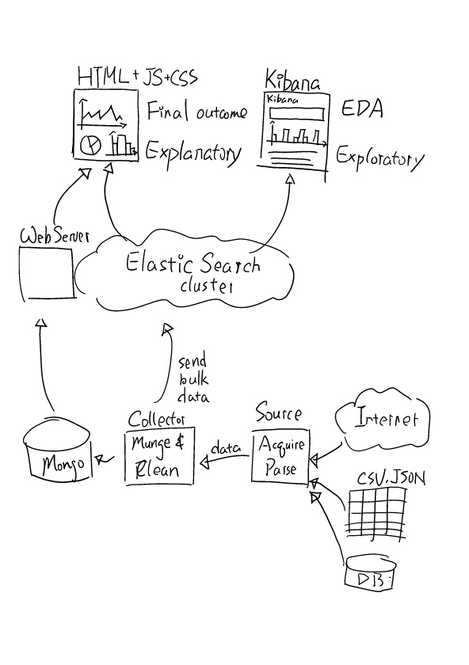
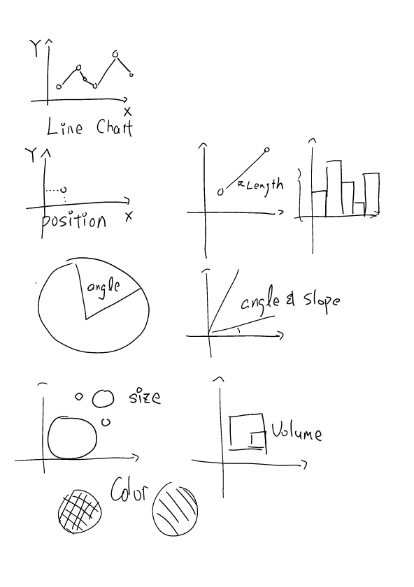

# Data Visualization

We've got some conclusions out of the data. How do we report this data to others?

## Architecture of the project

At this point, we are at the end of this lecture.

Lets spend some time to talk about out accomplishments so far:

We have built a data science project that is architected below:



1. We've built the *Source* to acquire and parse the data from internet or downloaded file
2. We've built the *Collector* to munge and clean the data
3. Also in *Collector* we send the data to our storage (primary to ElasticSearch)
4. Using ElasticSearch & Kibana, we do our EDA (Exploratory Data Analysis)
5. Using formal web graphing libraries to refine and polish our report in more of formal report

From here, we will learn to utilize some graphing libraries like D3 to refined our visualization earlier.

A quick disclaimer: this architecture is not the only architecture to do the data science project. In fact, there are many ways to do the data science project.

Moreover, you can replace any part in this architecture with a different technique.

In this class, we picked ElasticSearch as the central because it is the tool I think fits the best in our timeline.

In other word, for your future purpose. Please review the data science procedure and use that as a base instead of strictly following the architecture of this class project.

Be creative on the tools you choose and pick the right tool for the right need!

## What is visualization?

> A picture worths a thousand words.

Visualization is turning numbers (data) into pictures and into stories.

But how to define a good visualization vs bad ones?

Data visualization can be briefly list as exploratory vs explanatory.

### Exploratory

In earlier lecture, we learned how to do exploratory data analysis with Kibana by making a bunch of graphs.

This, so to speak, exploratory visualization. You are playing with different types of graphs in order to figure the best visualization to represent your data.

Using metaphor to explain -- you are finding a perfect rounded rock among a thousand rocks.

### Explanatory

A good explanatory visualization should cover the following five qualities:

1. Robust understanding of the context
2. Choosing appropriate type of visualization
3. Eliminating those things that are not aiding to the goal
4. Drawing audience's attention using color, size and other design aspect
5. Story

In short, your explanatory visualization should tell a story in a straight forward way.

Continued from the metaphor above, you are about to present this perfect rounded rock to your audiences.

Lets give an example -- think about the visualization like notes of lecture. Exploratory is like your notes to yourself while the explanatory is like notes from you to your audience (like my notes to all of students).

In other word, EDA is between you and your data and explanatory is between data directly to audience.

## Design process of creating data visualization

http://vizwiz.blogspot.com/2013/01/alberto-cairo-three-steps-to-become.html

## Art & Science

Data visualization is not just science, it is combining both art and science.

A good visualization will contain design elements inside like color, size and story telling elements.

In other word, you will need to have the ability to code, design as well as the ability to communicate.

I know that us as Computer Scientist; we really don't have a background of design nor the story telling. However, I'd love all of you to try your best for these two elements as part of your visualization.

Give it a try to create your best visualization and see what kind of challenges you are facing. 

In future, you may be working with others (which may cover your weakness) to create a fined graph!

In short, don't just treat data science as only software engineering. It is much larger than just coding!

We will try out best to covert both the coding and the design part of the visualization here.

## Example of good data visualization

Above talks about a few principles of good visualization. 

Can you give me example on a good visualization?

I think video by Hans Rosling best represents all three parts of good visualization (design, coding and story telling).

https://www.youtube.com/watch?v=jbkSRLYSojo

## Data Types

At this phase of project, we have a lot of data; and we category these data into a few different data types.

These categories of data types not only helps us to model better but also helpful toward the visualization aspect.

Think about the Kibana graph, you have to tell ElasticSearch ahead of time on what *mapping* (data type) a column is even before you send the data into ElasticSearch. 

An example of this is you will have to tell ElasticSearch this data is for geopoint rather than just two numbers (lat and long) in order to map these points on map!

For visualization, lets consider the following few categories of data types for simplification:

1. Numerical data
  * Numbers
2. Categorical data
  * Separate data into groups
3. Time series data

## Visual encoding

Visual encoding can be like position, size, length, angle, slope, color or even density.

For example, it's easy to think about line chart like below:



Rankings of visual encoding accuracy:

1. Position (like x, y)
2. Length
3. Angle & slope
4. Area (size)
5. Volume
6. Color & density

Reference: http://flowingdata.com/2010/03/20/graphical-perception-learn-the-fundamentals-first/

## Visualization technologies

We have far too many choices of doing visualization in web pages now. Like D3, NvD3, Chart.js, HighChart, SVG, WebGL ... etc.

We can level the above technologies from high level (easy to use but more restrictions) to low level (harder to use but higher flexibility).

In lowest level, we have WebGL, Canvas and SVG. One can certainly create graphs in this level but it will be a lot of work to create even a simple bar chart. However, you do get the flexibility of changing colors, positions and performance (only if you do it right).

In the middle level, we see D3. D3 provides a lot of flexibility while on the same time keeping its library API simple as possible. You still need to put medium level of effort to create simple type of graph. But on the same time, you will be able to create various graphs that is not just bar chart, line chart or other common charting solution.

On the high level, we have NvD3, HighChart and other tools. In this level, you are not really creating charts from start. Instead, you are doing similar work in Kibana vs using these libraries. You are plotting data into the library and have library do the rest.

Regardless of which level of implementation you choose, the goal is to pick the right tool for the right job!

In this class, we will be learning the underlying implementation from JavaScript first and then D3 finally using the high level libraries to do the job.

Libraries urls:

* [D3.js](https://d3js.org/)
* [NVD3.js](http://nvd3.org/)
* [HighChart](http://www.highcharts.com/)
* [Chart.js](http://www.chartjs.org/)
* [JavaScript DOM Api](https://developer.mozilla.org/en-US/docs/Web/API/Document_Object_Model)

## Intro to JavaScript

Before we talk about D3, it would be very helpful if we know how JavaScript works.

While there are many different aspects of JavaScript that is worth mentioning, I want to summarize the JavaScript into two most important concepts that are used in browser.

1. Dom selector API
2. Callback/promise

### Dom Selector API

In JavaScript, each node in browser is a document object model (DOM). You can do many different things with this DOM element such as adding on a click event listener or even to change the attributes of node.

But you have to know how DOM selector works before you can start to use this DOM element in JavaScript.

In a nutshell, DOM selector API is very close to how CSS selector works. In this level of class, I'm expecting students to know the CSS selector. If you don't know how CSS selector works or require a review on the subject of CSS selector. Please review [this site](https://css-tricks.com/how-css-selectors-work/)

BUT! I can hear the cynics.

> Why don't we just use jQuery!? It's easier this way. Just `$` everything and we are good to go!

To that, I present you this graph.


Please! Native JavaScript API has gone way much better in last 5 years. Unless you have to support IE6 or something legacy like that. You don't really jQuery. You don't!

In example, you can do the DOM selector API via `document.querySelector('#id .class')` and it works the same way as the jQuery `$('#id .class')` with better performance and one less library for you to rely on.

If you want to know more on how to replace jQuery, please go to [this site](http://youmightnotneedjquery.com/)

In short, learn native JavaScript API. They are amazing. And if you need to look up for the API documents, please go with MDN (Mozilla Developer Network).

### Callback

In JavaScript, it only have one thread for the display. This is why most JavaScript codes are all asynchronous functions.

This is probably by far the most important gotcha for Java developers to get into JavaScript.

What is asynchronous? You asked.

Consider the following code snippet:

```js
var request = new XMLHttpRequest();
request.open('GET', 'https://github.com');
request.send(null);
// this is wrong, you will get undefined
console.log(request.response);

// this is callback example
request.onreadystatechange = callback;

function callback() {
  if (request.readyState === XMLHttpRequest.DONE) {
    if (request.status === 200) {
      alert(request.responseText);
    } else {
      alert('There was a problem with the request.');
    }
  }
}
```

This is not the same as Java that you can always expect the method at line 1 always execute before line 2. Some methods are designed to execute asynchronously and you will have to apply *callback* in order to ensure method execution in synchronous order.

Therefore, when executing the JavaScript methods, make sure you know the concept of *callback*!

Another slightly more complex example

```js
function a (callback) {
  return function (callback2) {
    console.log('Method a gets called');
    // I'm using fat arrow function here for my own simplicity
    setTimeout(() => {
      callback(callback2);
    }, Math.random() * 5000);
    console.log('After method a gets called');
  }
}

function b (callback) {
  console.log('Method b gets called');
  alert('Alert blocks future method execution!');
  setTimeout(() => {
    callback();
  }, Math.random() * 5000);
  console.log('After method b gets called');
}

function c () {
  console.log('Method c gets called');
  console.log('this is where method execution gets finished');
}

a(b)(c);
console.log('and we are done???');
```

In summary, when the method doesn't get executed in the order you want. Please be aware that method can be asynchronous and you will need to do callback function.

## D3 (Data Driver Document)

Once you understand above two concepts (especially on the DOM selector part), you are now ready to move onto the D3 part.

So what is different from D3 and native JavaScript API?

It allows you to bind data directly to the DOM and provides various utilities method for visualization related computation.

Lets talk about the starting point first -- document seleciton

Consider the following code snippet in native JavaScript:

```js
var paragraphs = document.querySelectorAll('p');
for (var i = 0; i < paragraphs.length; i++) {
  var paragraph = paragraphs.item(i);
  paragraph.style.setProperty("color", "red", null);
}
```

Can exchanged with D3 code below:

```js
d3.selectAll("p").style("color", "red");
```

What about just want to modify single document?

```js
d3.select("body").style("background-color", "pink");
```

Since we are using JavaScript to manipulate the attributes, we can certainly add some dynamic attributes like below:

```js
// set random color per paragraph
d3.selectAll("p").style("color", function() {
  return "hsl(" + Math.random() * 360 + ",100%,50%)";
});
```

What makes D3 really as a solution toward visualization is its data binding:

```js
d3.selectAll("p")
    .data([4, 8, 15, 16, 23, 42])
    .style("font-size", function(d) { return d + "px"; });
```

What happened when the data gets changed after the initial binding?

You can use `enter` and `exit` method to tell D3 to add or remove nodes on adding and removing data.

```js
d3.select("body").selectAll("p")
    .data([4, 8, 15, 16, 23, 42])
    .enter().append("p")
    .text(function(d) { return "I’m number " + d + "!"; });
```

Why is this important?

With these few event binding, you will be able to change the graph upon user interaction. In example, you can say if user select different month of the default month, you can change the graph completely with the same code!

### How is D3 implemented behind the scene?

Or what technologies D3 is built upon?

D3 not like other visualization tools is built on top of native browser elements (HTML, SVG and CSS).

In example, you can create SVG element and style them later with external CSS stylesheet yourself.

### Animation

In addition to the static visualization, D3 also provides various animation utilities method like below:

```js
d3.select("body").transition()
    .style("background-color", "black");
```

`transition()` method will help a lot when you are using animation to tell further story!

### D3.scale

D3.scale method can help you to scale number of max and min to different scale.

This is helpful when you are graphing something on the x, y chart. 

e.g. you may have a data of domain from -46 to 32. This is extremely hard to graph if you just put it into the x, y axis in the SVG (which can range from 0 to 100). In other word, you will have to do scaling of this min and max of domain to the range.

### Example coding

Check visualizations/d3/basic.html

### Code a barchart

https://bost.ocks.org/mike/bar/

As reference, we are going to learn how to create a barchart in D3.

Check visualizations/d3/barchart.html

## The need for higher level library

Combine above examples, you start to see D3 code can slowly get more and more complex since it is, in my opinion, very low level implementaion.

Therefore, for the scope of this class, we will pick some higher level library like Chart.js to do our visualization.

Example of Chart.js

Check visualizations/chart.js/index.html

## Communicating to Server (ElasticSearch)

In traditional architecture, your visualization will be communicating to a web server (built by some developer).

To make more power to the data scientist and to be able to build quite high quality product at the end of this quarter. We decide to use ElasticSearch to replace the traditional web server layer.

Recall earlier architecture graph:


In this graph, visualization will need to make AJAX request to the server to grab data from server.

But in this class, since we are using ElasticSearch, we can simply use the ElasticSearch client to query data directly from ElasticSearch without us building any sort of web server.

To show a demonstration, open up visualization/chart.js/with-elastic.html

> Note that you will have to run `npm install` first to install required dependencies.

## Summary

From here we have learned how to use graphing library to visualize.

It is your job to put together graphs into an HTML page for your final project that talks to ElasticSearch.

Further reading: https://www.elastic.co/blog/data-visualization-elasticsearch-aggregations

## Objectives

* Basic chart types
  * Bar chart, pie chart, line chart, heap map, geo map ... etc
* Basic JavaScript, HTML and CSS review
* D3

## Metrics

* Visualization of data
