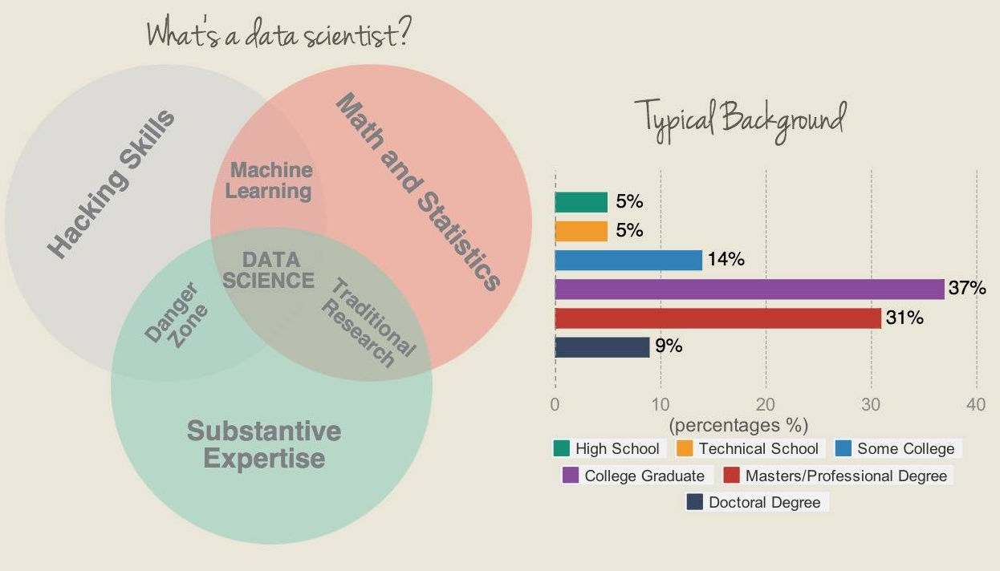
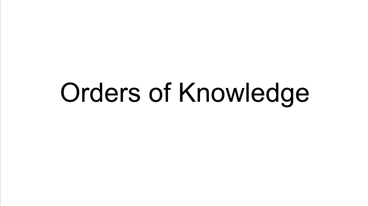

# Introduction

Welcome to Data Science course again!

## Objectives

* [Syllabus](../syllabus.md)
* Introduction to Data Science
* Set up development environment (Java & Gradle)
* [Form a team & create Github team repo][1]

## Metrics

* [Github team repo][1]
* Data question - [homework 1](../notes/homeworks/homework1.md)
* Pass unit tests

### What is data science?


Credit: http://i.imgur.com/AfFMkHe.jpg

Data scientist is to make sense of data to make conclusion or even to predict outcome based on the data sets.

Common skill sets of data scientist:

* Math Statistics
* Python / R
* D3 or some other visualization tool
* Hadoop / Elastic Search
* Database reading knowledge (like sql query, mongo db script)
* Machine learning

**Recommended readings**

* [What is data science by O'reilly](https://www.oreilly.com/ideas/what-is-data-science)
* [The sexiest job at 21th century by Hbr](https://hbr.org/2012/10/data-scientist-the-sexiest-job-of-the-21st-century/ar/1)

### Class Overview

1. Question  
In this class, we will be starting by asking **question**. Your job this week is to
do a lot of research on the question such as what data sets can you use to support
your question/statement.
2. Acquiring  
With a good question, you will likely want to start your project by **acquiring data**.
We will be programming in our *favorite language*, Java. In other word, your job
is to implement my data collector interface and implement detail to collect data.
3. Storage  
After collecting huge amount of data, it's important to make decision on how to **store them**.
To simplify our life a little bit, we will be using *MongoDB* as the primary database
with Elastic Search as the secondary database for quick searching and exploring.
4. Explore & Analysis  
Then, we will cover the most important part of the course, **analytics**. In this part,
we will start by utilizing Elastic Search for quick exploring of data. In other word,
you can use Elastic Search a lot to do quick searching and make sense out of this
huge set of data. After having some basic knowledge of the data, we will be learning
on how to process them to do analysis. We will go over some basic Python with its
libraries to do some basic Machine Learning.
5. Communication via visualization  
Once you are done analysis, we will be learning on how to create visualization based
on the analysis we done earlier!

### What makes a good question?

For the purpose of this course we consider the order of knowledge:

* First order: obtaining information directly from the data or metadata
* Second order: comprehension of first order knowledge
* Third order: derive inferential information or predicting an outcome that is derived from data

A good question is aim to address third order knowledge! In other word, just download a data set and get the size of data is not consider to be good question!
This video dives further indepth into how to formulate a good question for Data Science.

[](https://youtu.be/fEVZG5nYzqM)


### Some starting points of data sets

[Awesome data sets](https://github.com/caesar0301/awesome-public-datasets)

You may use the above awesome list to find out some initial good data
sets as a starting point to ask some good questions.

[Kaggle](https://www.kaggle.com/)

Kaggle is awesome machine learning or data analytics competition site.
It may be interesting to see if you can resolve one of their open
challenge with the techniques we learn in this class.

[Google public data set](https://cloud.google.com/bigquery/public-data/)

Google also provides some data set that you can use their BigQuery to do some processing.

[AWS pubilc data set](https://aws.amazon.com/public-data-sets/)

Amazon hosts some data set as well!

### What is considered to be big data?

* Volume
* Velocity
* Variety

Above 3Vs define the properties of big data. Volume refers to the size of data (GB, TB or even PB), variety refers to the number of types of data and velocity refers to how fast slow data comes in.

**Interesting trending**

> Big data got started from 1990s to early 2000s when larger internet companies forced to invent new way to manage big volume of data. Today, most people think of Hadoop or NoSQL database like MongoDB when they of Big Data.  However, the original core components of Hadoop,
HDFS (Hadoop Distributed File System—for storage), MapReduce (the compute engine), and the resource
manager now called YARN (Yet Another Resource Negotiator) are rooted in the batch-mode or offline
processing commonplace ten to twenty years ago, where data is captured to storage and then processed
periodically with batch jobs. Most search engines worked this way in the beginning. The data gathered by
web crawlers was periodically processed into updated search results.  
- [Fast Data: Big Data Evolved By Dean Wampler, PhD](https://info.lightbend.com/COLL-20XX-Fast-Data-Big-Data-Evolved-WP_LP.html?lst=WS&lsd=COLL-20XX-Fast-Data-Big-Data-Evolved-WP)

---

### Development Environment Setup

1. Install [Java](http://www.oracle.com/technetwork/java/javase/downloads/jdk8-downloads-2133151.html) if you have not done so
> Keep it in mind you have to set up Java in `Path` variable for windows user  
> You should be able to do `java -version` to see 1.8 as version from here
2. Install [Gradle](http://gradle.org/)
> Remember to set up `JAVA_HOME` pointing to where you install your JDK  
> You should be able to run `gradle -v` to see gradle version
3. Install [Git](https://git-scm.com/)
> You should be able to find git bash under windows if you already install it
4. Clone this repository
> `git clone` or use Github client or download as zip whatever you want
5. Run `gradle test`

#### Java

Install [OracleJDK 8](http://www.oracle.com/technetwork/java/javase/downloads/index.html) if you don't already have one.

##### Windows User

Click on the link above (OracleJDK 8) to download Java 8. Upon completion of
download, please set up the `PATH` path on your advanced environment settings from right click on your computer.

> Remember to set it to your JDK **bin** folder

##### Mac User

You can install [brew](http://brew.sh/) and follow the following to install Java 8.

```sh
brew tap caskroom/cask
brew install brew-cask
brew cask install java
```

#### Gradle

Install [Gradle](https://gradle.org/) as this will be our primary build tool.

##### Windows User

Click on the link above and install Gradle accordingly. Remember to set up `PATH`
variable so that your terminal knows Gradle is executable.

Also you will need to set up `JAVA_HOME` pointing to your JDK folder. In example, `C://jdk8/`

##### Mac User

Install via `brew install gradle` assuming you have `brew` installed.

##### Linux User

* CentOS users can follow the instruction found in [Github Gist](https://gist.github.com/parzonka/9371885).  
* Ubuntu users take a look at the [Ask Ubuntu Stack Exchange Tutorial](https://askubuntu.com/questions/328178/gradle-in-ubuntu).

##### To check Gradle is installed

Please run `gradle -v` anywhere from terminal. You should see Gradle version as 2.12.

### Wrap Up Java Review Exercise

Clone/download the course repository, run `gradle hello` after you are done. You should see
`Hello Data Science` as the console output.

Once you have above environment set up, please remove all the `@Ignore` from `src/test/edu/csula/datascience/examples/SimpleStatsTest.java` and pass all the test from there.

What you want out of this class is `gradle test` passes.

#### Eclipse Gradle plugins

With above being done, you can start modifying your project in Eclipse. However, you are
still not able to run the Gradle tasks. Therefore, you will also need this *Eclipse Gradle Plugin*
to run the Gradle tasks (e.g. hello)

**Instructions to install Gradle plugins in Eclipse**

1. In Eclipse Open Help >> Install New Software
2. Paste a Gradle update site link -- http://dist.springsource.com/release/TOOLS/gradle -- into the "Work with" text box.
3. Click the Add button at the top of the screen.
4. Ensure that the option "Group Items by Category" is enabled.
5. Select the top-level node 'Extensions / Gradle Integration'.
6. Click "Next". This may take a while.
7. Review the list of software that will be installed. Click "Next" again.
8. Review and accept license agreements and Click "Finish".

**Instructions to run Gradle tasks in Eclipse**

1. import this repository as gradle project
2. Right click and run gradle task

> Although I do suggest all of you to run tasks from terminal/cmd.

#### Recommended readings for Gradle

* http://gradle.org/getting-started-gradle-java/
* http://www.vogella.com/tutorials/Gradle/article.html

#### Recommended reading for Git/Github

If you have trouble with Git/Github, you can look through [this document](https://github.com/csula/cs460-fall-2015/blob/master/documents/misc/github-tutorial.md) as quick tutorial.

Still have trouble? Please feel free to raise your hand and I'll be walking around to help.

### Unit Testing

Test Driven Development or Behavior Driven Development gives you a lot more confidence of refactoring in future. Moreover, testing is often being adapted at more popular Open Source projects. Why? Because testing gives the confidence of merging codes from unknown developers.

How do we measure unit test?

In this class, I'll set up Coverall as the code coverage tool to measure how much unit tests students implement. This will give me fair amount of testing you implement for your project. Example can be seen in [this repo](https://github.com/csula-students/beautiful-data-project-test/).

### So how do you test?

* Dependency Injection
* Avoid static state
* Keep each unit small

**Dependency Injection**

Dependency injection doesn't need to always be done by framework like [Guice](https://github.com/google/guice). Put it simple, you can define dependency in your constructors. If you want to get fancy, you might want to use `Factory pattern` to protect your constructors logic being exposed.

All in all, you want to keep your module dependency being defined in clear way so you can mock them.

In example, if you have a piece of code need to take object from database. Instead of:

```java
public class Test {
  public Map<String, Integer> countNumberOfWords() {
    try (Connection c = getConnection()) {
      String sql = "SELECT * FROM test";

      // use connection and get list of object out
    }
  }
}
```

to:

```java
public class Test {
  public Map<String, Integer> countNumberOfWords(List<Test> tests) {
    // count number of words using plain old java object
    // this way, code becomes easily testable and mockable
  }
}
```

Why testings need to be done at design phase?

When designing your functions/methods, you have to think about how to test it. What dependencies do you need for object and so on. If you do testing afterward, it simply becomes impossible to mock any dependency because they are too deep into your code.

### Further reading

* https://github.com/okulbilisim/awesome-datascience
* http://mattturck.com/2016/02/01/big-data-landscape/
* http://stackoverflow.com/research/developer-survey-2016

[1]: https://classroom.github.com/group-assignment-invitations/6892eb1f5c3ebe3a94c1fa6f81af5813
